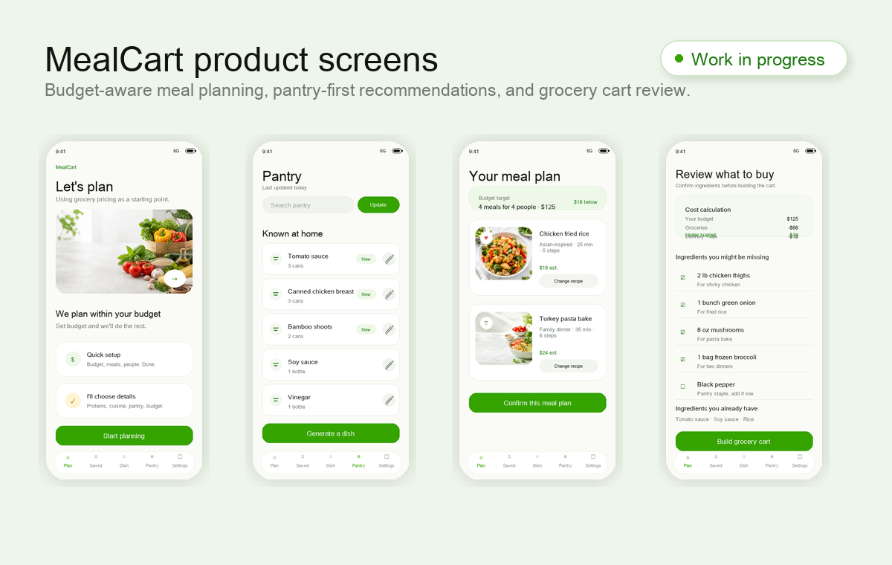
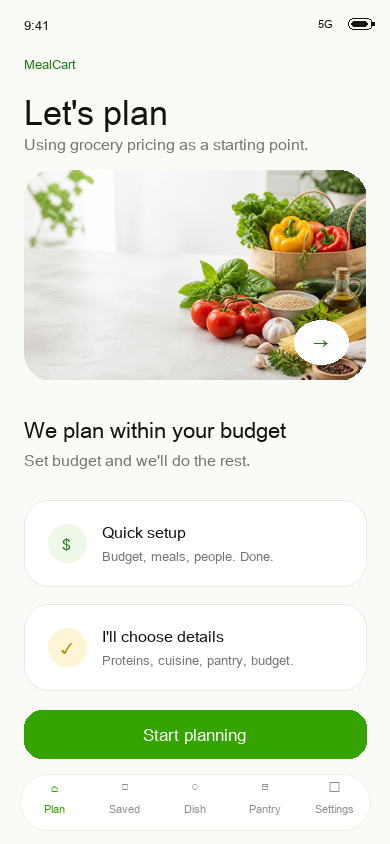
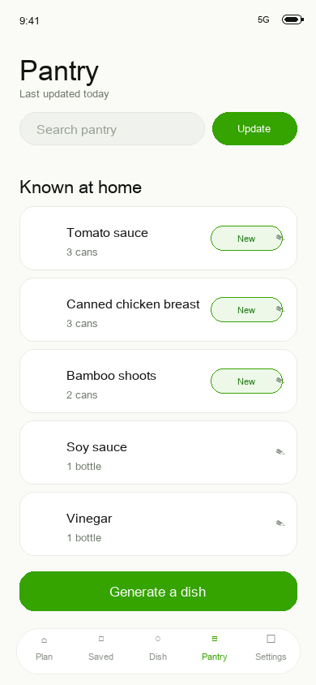
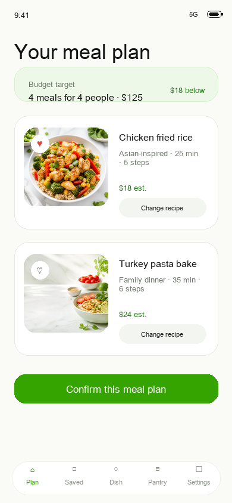
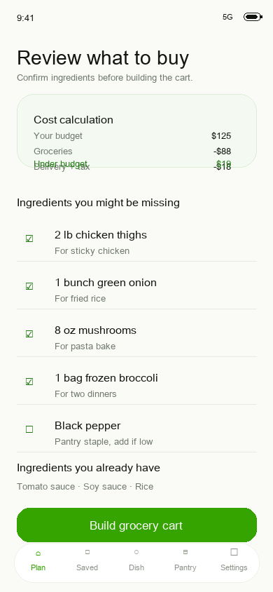

# MealCart: Budget-Aware Meal Planning Case Study

MealCart is a product case study for a budget-aware grocery and meal planning app.

The app concept helps a household set a grocery budget, use pantry items first, generate practical meal plans, and prepare a grocery cart handoff for checkout with a supported grocery provider.

This public repository is intentionally a **portfolio and product documentation repo**, not the private application source code. It focuses on the product strategy, architecture, usability lessons, technical tradeoffs, and next build steps.

## AI-Powered Features

MealCart explores how AI can reduce the most tedious parts of grocery planning:

- Photo-based pantry scanning to detect grocery items from pantry or fridge photos.
- Pantry-aware recipe generation that starts with ingredients already at home.
- Budget-aware meal planning that recommends meals before the cart is built.
- AI-assisted substitutions and lower-cost swaps when a plan may go over budget.
- Grocery cart preparation so users can review and finish checkout with the provider.

## Problem

Weekly grocery planning is fragmented.

People often have to:

- decide what to cook
- remember what they already have
- compare recipes against budget
- estimate grocery totals
- search for substitutions
- rebuild the same ingredient list inside a grocery app
- review availability, coupons, substitutions, taxes, delivery fees, and checkout manually

MealCart explores whether an assistant can make that workflow faster without removing the user's final control over what they buy.

## Product Direction

The current MVP direction is:

- Native iOS experience for personal and family meal planning.
- Budget-first recipe recommendations.
- AI-powered pantry scanning from photos, with user review before items are saved.
- Pantry-aware planning so existing ingredients reduce grocery spend.
- AI-assisted dish generation for quick single-meal ideas from what is already at home.
- Grocery-provider handoff instead of fully automated checkout.
- Clear final review before the user buys anything.
- Privacy-conscious architecture that keeps provider tokens and AI keys out of the app.

## Public Contents

- [Case Study](./case-study.md)
- [Architecture](./architecture.md)
- [Lessons Learned](./lessons-learned.md)
- [Product Roadmap](./roadmap.md)
- [Privacy And Security Notes](./privacy-and-security.md)

## Demo Screens

These screens use sanitized sample data and generated food imagery. They are included to show the intended product direction without exposing private app source code, pantry photos, user accounts, or backend details.

| Plan start | Pantry | Meal plan | Shopping list |
| --- | --- | --- | --- |
|  |  |  |  |

## What Is Not Included

This public repo does not include:

- private app source code
- live backend URLs
- API keys
- OAuth client secrets
- user tokens
- personal pantry photos
- private test account details

## Portfolio Summary

MealCart demonstrates product thinking across:

- AI-assisted meal planning
- AI-powered pantry photo recognition
- AI recipe and dish generation
- OCR and vision-based pantry recognition
- grocery API feasibility
- OAuth and cart handoff constraints
- budget-aware recommendation design
- iOS UX flows for review, confirmation, and recovery
- practical privacy and deployment tradeoffs

## Status

Private working prototype in progress.

Public status: case study and product documentation ready for portfolio review.
